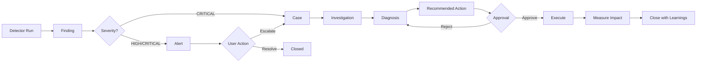

# 🦑 LUCA API - Iteración 3: El Sistema Nervioso

**"El Sistema Nervioso"** - Case Management completo con State Machine, Alertas con Routing, y Acciones con Approval Flow.

## Qué hay de nuevo en v0.3.0

### State Machine de Casos

Flujo completo de un caso LUCA:

```
OPEN → INVESTIGATING → DIAGNOSED → RECOMMENDED → APPROVED → EXECUTING → EXECUTED → CLOSED
```

Con salidas anticipadas:
- `CLOSE_AS_NOISE` desde OPEN
- `CLOSE_AS_FALSE_POSITIVE` desde INVESTIGATING  
- `CLOSE_NO_ACTION_NEEDED` desde DIAGNOSED

### Servicios Nuevos

| Servicio | Descripción |
|----------|-------------|
| `caseService.js` | CRUD completo de casos con state machine |
| `alertService.js` | Alertas con routing y deduplicación |
| `actionService.js` | Acciones con flujo de aprobación |
| `routingService.js` | Decide quién recibe qué según preferencias |
| `auditService.js` | Registro de todas las operaciones |

### Rutas Nuevas

| Archivo | Rutas |
|---------|-------|
| `routes/cases.js` | `/api/luca/cases/*`, `/api/luca/alerts/*`, `/api/luca/actions/*`, `/api/luca/audit/*` |

## API Endpoints

### Cases

```bash
# Listar casos
GET /api/luca/cases?state=OPEN&severity=HIGH&limit=50

# Casos abiertos (dashboard)
GET /api/luca/cases/open

# Estadísticas
GET /api/luca/cases/stats?days=30

# Detalle de un caso
GET /api/luca/cases/:id

# Crear caso manual
POST /api/luca/cases
{
  "case_type": "FRAUD",
  "severity": "HIGH",
  "title": "Descuentos anómalos en SUC01",
  "description": "Empleado X con 35% de descuento",
  "scope": { "branch_id": "SUC01" },
  "created_by": "jorge"
}

# Transición de estado
POST /api/luca/cases/:id/transition
{ "event": "START_INVESTIGATION", "actor_id": "jorge" }

# Iniciar investigación (shortcut)
POST /api/luca/cases/:id/investigate
{ "actor_id": "jorge" }

# Agregar evidencia
POST /api/luca/cases/:id/evidence
{
  "evidence": {
    "type": "screenshot",
    "description": "Recibos de descuento",
    "data": { "url": "..." }
  },
  "actor_id": "jorge"
}

# Agregar hipótesis
POST /api/luca/cases/:id/hypothesis
{
  "hypothesis": {
    "title": "Sweethearting con familiares",
    "description": "Empleado aplica descuentos a familiares",
    "confidence": 0.8
  },
  "actor_id": "jorge"
}

# Diagnosticar
POST /api/luca/cases/:id/diagnose
{
  "diagnosis_text": "Confirmado sweethearting con 15 transacciones",
  "confirmed_hypothesis_id": "HYP-123",
  "actor_id": "jorge"
}

# Recomendar acción
POST /api/luca/cases/:id/recommend
{
  "action": {
    "type": "NOTIFY_MANAGER",
    "title": "Notificar a gerente de sucursal",
    "description": "Enviar reporte con evidencia",
    "requires_approval": true
  },
  "actor_id": "luca"
}

# Aprobar acción
POST /api/luca/cases/:id/actions/:actionId/approve
{ "actor_id": "jorge" }

# Rechazar acción
POST /api/luca/cases/:id/actions/:actionId/reject
{ "actor_id": "jorge", "reason": "Prefiero hablar primero" }

# Cerrar caso
POST /api/luca/cases/:id/close
{
  "outcome": { "result": "Empleado amonestado", "savings": 5000 },
  "actor_id": "jorge",
  "notes": "Resuelto satisfactoriamente"
}

# Reabrir caso
POST /api/luca/cases/:id/reopen
{ "actor_id": "jorge", "reason": "Nueva evidencia" }

# Timeline del caso (audit)
GET /api/luca/cases/:id/timeline
```

### Alerts

```bash
# Listar alertas
GET /api/luca/alerts?state=ACTIVE&severity=HIGH&branch=SUC01

# Alertas activas (dashboard)
GET /api/luca/alerts/active

# Estadísticas
GET /api/luca/alerts/stats?days=30

# Detalle
GET /api/luca/alerts/:id

# Crear alerta manual
POST /api/luca/alerts
{
  "alert_type": "SALES_DROP",
  "severity": "HIGH",
  "title": "Caída de ventas en SUC02",
  "message": "Ventas cayeron 20% vs ayer",
  "branch_id": "SUC02",
  "expires_in": 24
}

# Acknowledge
POST /api/luca/alerts/:id/ack
{ "actor_id": "jorge" }

# Resolver
POST /api/luca/alerts/:id/resolve
{
  "actor_id": "jorge",
  "resolution": "Problema de TPV, ya resuelto"
}

# Escalar a caso
POST /api/luca/alerts/:id/escalate
{ "actor_id": "jorge" }

# Batch acknowledge
POST /api/luca/alerts/batch/ack
{
  "alert_ids": ["ALT-001", "ALT-002"],
  "actor_id": "jorge"
}
```

### Actions

```bash
# Listar acciones
GET /api/luca/actions?state=PENDING&case_id=CASE-001

# Acciones pendientes de aprobación
GET /api/luca/actions/pending

# Estadísticas
GET /api/luca/actions/stats?days=30

# Detalle
GET /api/luca/actions/:id

# Aprobar
POST /api/luca/actions/:id/approve
{ "actor_id": "jorge", "notes": "Proceder" }

# Rechazar
POST /api/luca/actions/:id/reject
{ "actor_id": "jorge", "reason": "No aplica" }

# Ejecutar (después de aprobar)
POST /api/luca/actions/:id/execute
{ "executed_by": "system" }

# Cancelar
POST /api/luca/actions/:id/cancel
{ "actor_id": "jorge", "reason": "Ya no es necesario" }
```

### Audit

```bash
# Consultar audit log
GET /api/luca/audit?target_type=case&target_id=CASE-001

# Por actor
GET /api/luca/audit?actor_id=jorge&from_date=2026-01-01

# Estadísticas
GET /api/luca/audit/stats?days=30
```

### Routing

```bash
# Estado del routing (quiet hours, etc)
GET /api/luca/routing/status
```

## State Machine

### Estados de Caso

| Estado | Descripción | Transiciones Posibles |
|--------|-------------|----------------------|
| `OPEN` | Caso recién creado | START_INVESTIGATION, CLOSE_AS_NOISE |
| `INVESTIGATING` | En investigación | ADD_EVIDENCE, DIAGNOSE, CLOSE_AS_FALSE_POSITIVE |
| `DIAGNOSED` | Diagnóstico completado | RECOMMEND_ACTION, CLOSE_NO_ACTION_NEEDED |
| `RECOMMENDED` | Acción recomendada | APPROVE_ACTION, REJECT_ACTION, MODIFY |
| `APPROVED` | Acción aprobada | START_EXECUTION, CANCEL |
| `EXECUTING` | En ejecución | EXECUTION_SUCCESS, EXECUTION_FAILED |
| `EXECUTED` | Ejecutado | START_MEASUREMENT, SKIP_MEASUREMENT |
| `MEASURING` | Midiendo impacto | MEASUREMENT_COMPLETE |
| `MEASURED` | Medición completada | CLOSE_WITH_LEARNINGS |
| `CLOSED` | Cerrado | REOPEN |

### Estados de Alerta

| Estado | Descripción |
|--------|-------------|
| `ACTIVE` | Alerta activa, requiere atención |
| `ACKNOWLEDGED` | Vista por usuario |
| `RESOLVED` | Resuelta |
| `ESCALATED` | Convertida a caso |
| `EXPIRED` | Expirada automáticamente |

### Estados de Acción

| Estado | Descripción |
|--------|-------------|
| `PENDING` | Pendiente de aprobación |
| `APPROVED` | Aprobada, lista para ejecutar |
| `REJECTED` | Rechazada |
| `EXECUTING` | En ejecución |
| `EXECUTED` | Ejecutada exitosamente |
| `FAILED` | Ejecución fallida |
| `CANCELLED` | Cancelada |

## Routing de Alertas

El sistema decide quién recibe qué según:

1. **Severity threshold** - Usuario solo recibe alertas >= su nivel mínimo
2. **Watchlist de sucursales** - Si usuario tiene watchlist, solo recibe de esas
3. **Quiet hours** - De 10pm a 7am, solo CRITICAL interrumpe
4. **Canales** - tower (in-app), whatsapp, email, sms

### Configuración de Usuario (tower_users)

```json
{
  "notification_prefs": {
    "severity_min": "MEDIUM",
    "channels": ["tower", "whatsapp"],
    "quiet_hours": {
      "start": 22,
      "end": 7
    }
  },
  "watchlists": {
    "branches": ["SUC01", "SUC02"]
  }
}
```

## Audit Log

Todas las operaciones se registran automáticamente:

| Campo | Descripción |
|-------|-------------|
| `actor_type` | user, system, detector, scheduler |
| `actor_id` | ID del actor |
| `action` | CASE_CREATED, ALERT_ACKNOWLEDGED, etc. |
| `target_type` | case, alert, action, finding |
| `target_id` | ID del target |
| `changes` | Qué cambió |
| `context` | Contexto adicional |

## Flujo Completo: Finding → Case → Action



## Variables de Entorno

```bash
# Habilitar scheduler automático
ENABLE_SCHEDULER=true

# Puerto (default 3002)
PORT=3002
```

## Próxima Iteración

**Iteración 4: "Los Ojos"** - Control Tower PWA
- Next.js PWA instalable en móvil
- The Feed con tarjetas en tiempo real
- Approve/Reject desde móvil
- Push notifications
- Dashboard por socio
